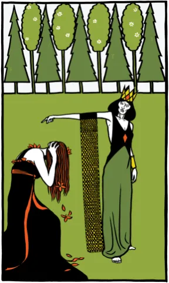
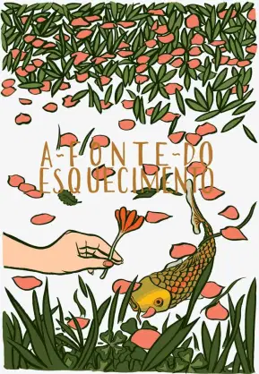
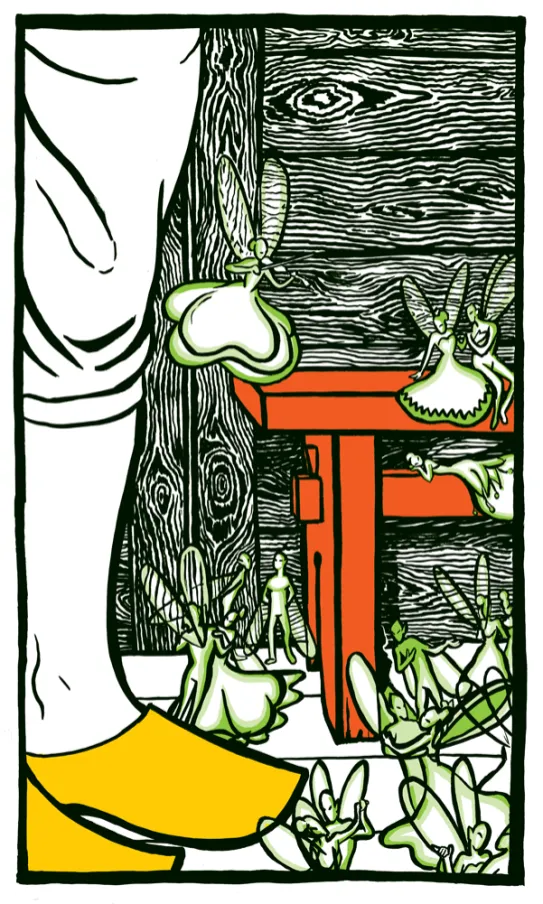
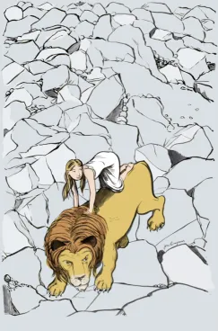
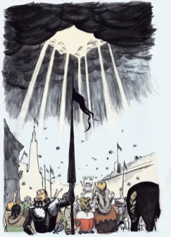
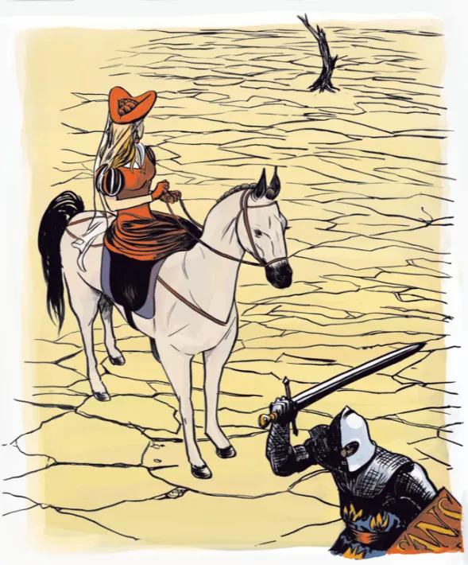

Acabei de receber os meus exemplares de autor das minhas obras mais recentes: [A Fonte do Esquecimento](/livros/a-fonte-do-esquecimento-edelbra) e [Una e o Leão](/livros/una-e-o-leao-sesi), ambos projetos muito queridos. Na Fonte experimentei com um estilo bem vienense, art-nouveau e gostei bastante dos resultados. Com certeza vou trabalhar um pouco nesta direção em alguns projetos futuros. Se trata de uma coleção de contos antigos e pouco conhecidos pesquisados e adaptados por [Heloisa Prieto](https://www.facebook.com/HeloisaPrieto), que também é a autora do próximo livro. Editora Edelbra, ISBN 978-85-66470-99-4. [Mais imagens.](/livros/a-fonte-do-esquecimento-edelbra/)

- 
- 
- 

Na Una experimentei com um traço mais difuso, menos definido do que normalmente, trabalhando mais com sombras e volumes. Busquei referências no renascimento alemão por se tratar de uma história originalmente escrita no seculo 16 (embora inglesa), pelo contemporâneo de Shakespeare, [Edmund Spenser](https://pt.wikipedia.org/wiki/Edmund_Spenser). Editora Sesi-SP, ISBN 978-85-8205-963-0. [Mais imagens.](/livros/una-e-o-leao-sesi/)

- 
- 
- 
