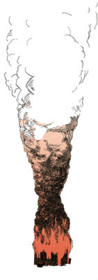

O livro "Tarantula" de Bob Dylan, lançado em 1971, agora também foi editado em português. A Folha publicou um trecho desse texto, escrito no estilo de "fluxo de consciência", na contracapa da Ilustríssima. Essa foi a minha ilustração que se refere à menção de um incêndio neste texto bastante aberto.
