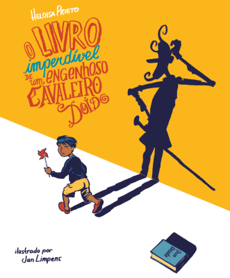

Os livros "[O livro imperdível](//limpens.com/portfolio/o-livro-imperdivel-atica/)" e "[Andarilhas](//limpens.com/portfolio/andarilhas/)" ambos de Heloisa Prieto e ilustrado por mim, foram selecionado para o catálogo internacional de Bologna fnlj 2016, representando Brasil. Para quem quiser ver o catálogo - ele está [aqui](http://www.fnlij.org.br/site/publicacoes-em-pdf/catalogos-de-bolonha/item/727-cat%C3%A1logo-fnlij-para-feira-de-bolonha-2016.html)! A Folha de S.Paulo também escreveu sobre os Andarilhas - [aqui](http://www1.folha.uol.com.br/folhinha/2016/01/1732446-menino-descobre-a-graca-de-dom-quixote-em-novo-livro-para-criancas.shtml).
