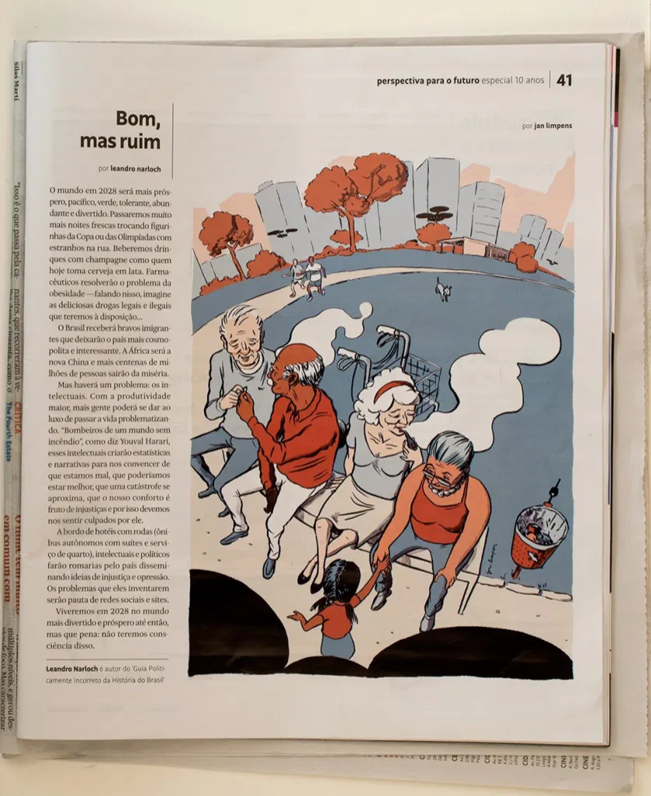

Serafina é um suplemento de estilo de vida, moda e cultura da Folha de S.Paulo. Perguntaram um monte de ilustradores como imaginem a nossa vida daqui a 10 anos. Apostei na liberação de maconha e seu uso em público — em baixo dos olhos de drones que reportariam todos os nossos atos. Uma ilustração no miolo — não conheci o texto, que até combina.

