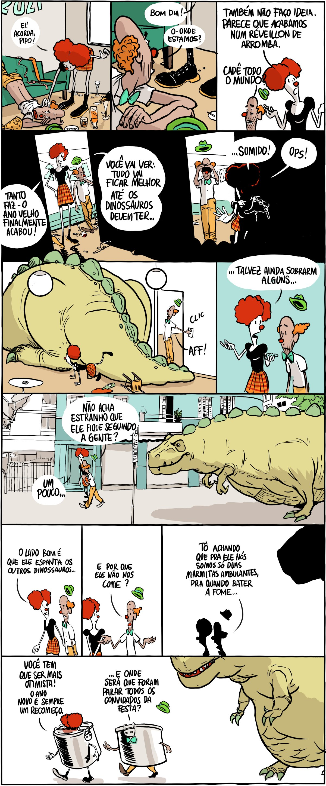
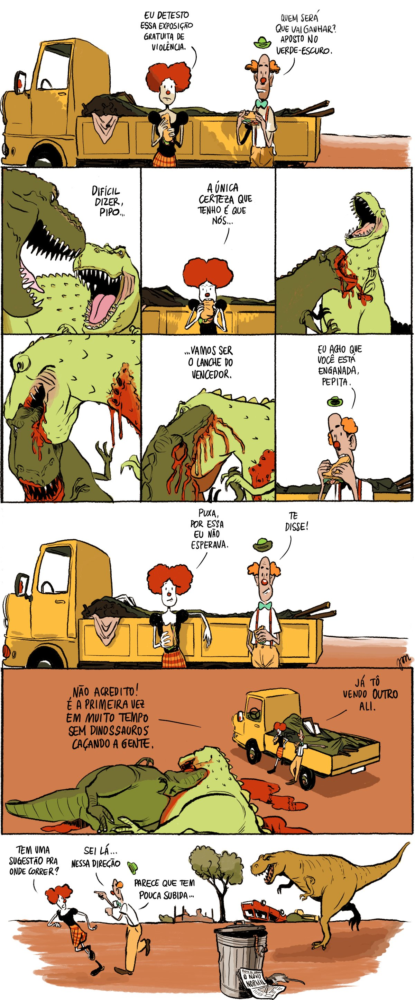

O ano recomeçou e Pepita continua na fuga dos dinossauros. Da comforto, que certas coisas aparentemente não mudaram, mas também se percebe uma certa ignorânça na parte da heroína. A Pepita provavelmente nem sabe que deveria usar uma mascara, já dos dinossauros nem se fala.

[Quadrão na Folha de S. Paulo, 04/01/2021](https://www1.folha.uol.com.br/ilustrada/cartum/cartunsdiarios/#04/01/2021).

[Quadrão na Folha de S. Paulo, 08/02/2021](https://www1.folha.uol.com.br/ilustrada/cartum/cartunsdiarios/#08/02/2021).
